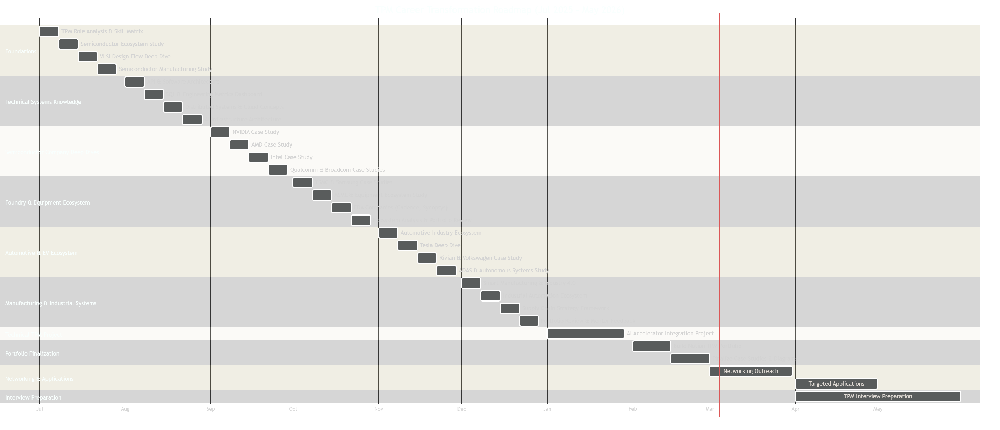

# TPM-Roadmap
Aspiring **Technical Program Manager** | Transforming my career from **Technical to Program Leadership**.  
Currently building a comprehensive **TPM portfolio** to demonstrate strategy, execution, risk management, and cross-functional leadership.

---

### **🚀 [View the Live Program Dashboard & Portfolio](https://ishan-gupta-53783y5.gamma.site/)  🚀**

---

# Project Charter 

  
  
  
  

---

## 📖 Project Description  
This project is a **career transformation initiative** designed to:  
1. Build **domain knowledge across emerging tech sectors** such as advanced manufacturing, automotive, and digital systems.  
2. Demonstrate **TPM competencies** through structured projects, planning frameworks, and leadership artifacts.  
3. Deliver a **portfolio artifact** that proves capability in execution strategy, stakeholder alignment, and lifecycle management.  

---

## 🎯 Purpose & Justification  
> ⚡ **Why now?**  
Technology-driven industries are evolving rapidly — they demand TPMs who can align **business strategy, engineering execution, and innovation scalability**.  
This roadmap enables a **career transition into TPM roles within 6–7 months**, backed by a portfolio demonstrating tangible leadership and delivery skills.  

---

## ✅ Objectives (SMART Goals)  
- 📘 Build **cross-domain knowledge** by **September 2025** (manufacturing, automation, systems integration).  
- 📊 Produce **3–4 TPM-style case studies/projects** by **December 2025**.  
- 💼 Apply to **20 targeted TPM roles** everyday from Jan 2026.  

---

## 📦 Scope  
**In-Scope:**  
✔️ Learning key ecosystems and technologies driving modern industries  
✔️ Developing dashboards, case studies, and visual roadmaps  
✔️ Networking with professionals and recruiters for TPM insights  

**Out-of-Scope:**  
❌ Purely technical engineering without program-level context  
❌ High-cost certifications unrelated to TPM transition goals  

---

## 👥 Stakeholders & Roles  
| Role | Name/Group | Responsibility |  
|------|-------------|----------------|  
| **Sponsor** | Ishan Gupta | Drive project, define milestones, and ensure delivery |  
| **Primary Stakeholders** | Hiring Managers, Recruiters | Evaluate portfolio and professional readiness |  
| **Advisors/Mentors** | Professors, Industry TPMs, Alumni | Provide strategic and career guidance |  
| **Peers/Collaborators** | NCPMI, SWE, Study Groups | Review progress, share learning resources |  

---

## 📂 Deliverables  
- 📊 **Learning Dashboard** → Tracks progress across technology and management domains  
- 🗂️ **Case Studies/Projects** → 3–4 portfolio-ready TPM examples  
- 📅 **6-Month Gantt Roadmap** → Phase-wise progression visualization  
- 🤝 **Networking Log** → Track events, interviews, and outreach efforts  
- 🌐 **Final Portfolio Page** → GitHub + LinkedIn integrated showcase  

---

## 🗓️ Timeline  

  

| Phase | Dates | Milestones |  
|-------|--------|-------------|  
| **Foundation** | Jul – Sep 2025 | Ecosystem learning, dashboard setup, 1st case study |  
| **Application** | Oct – Dec 2025 | Case studies execution, networking, portfolio build |  
| **Transition** | Jan 2026 | Final portfolio delivery, applications, interviews |  

---

## ⚠️ Risks & Mitigation  
- ⏳ **Time Constraint** → Structured weekly time-blocking & milestone tracking  
- 📚 **Learning Depth** → Dashboard-based tracking and curated learning material  
- 🤝 **Network Gaps** → Early outreach, mentorship sessions, and event participation  

---

## 📊 Success Metrics  
- 🎓 **Knowledge:** 80%+ modules completed  
- 📝 **Portfolio:** 3–4 completed case studies/projects  

---

## 🔍 Deep Dives  

📘 Core Focus Areas
  

- **Systems & Product Lifecycle Management** — Planning, risk tracking, and stage gate reviews  
- **Technology Integration** — Aligning software, hardware, and operations workflows  
- **Process Optimization** — Continuous improvement through data and analytics  
- **Innovation Strategy** — Bridging R&D insights to scalable delivery outcomes  

*Why it matters*: Understanding full lifecycle and ecosystem dynamics enables TPMs to anticipate risks, optimize workflows, and lead effective cross-functional delivery.  

  

🛠️ Skills & Tools TPMs Value
  

- **Program Management** → Jira, Confluence, Notion, Trello  
- **Data & Reporting** → Excel, Power BI, SQL, Tableau  
- **Lifecycle Frameworks** → Agile, SAFe, Waterfall, Stage-Gate  
- **Leadership & Communication** → Stakeholder management, decision alignment, executive updates  
- **Technical Awareness** → Systems design, integration testing, validation processes  

  

---

## ✍️ Sign-off  
**Project Sponsor:** Ishan Gupta  
📅 **July 2025**  

---

### 🌟 Why This Matters  
This charter is a blueprint for **strategic career transformation** — combining project discipline, learning agility, and real-world TPM execution.  
Every artifact in this repository demonstrates how structured program management principles can drive clarity, results, and measurable growth.  

### Quick Links
Strategic & Technical Foundation
* [Semiconductor Ecosystem Map](https://github.com/Ishan0520/TPM-Roadmap/blob/main/Semiconductor%20Ecosystem.md)
* [The Core Process: VLSI Design Flow](https://github.com/Ishan0520/TPM-Roadmap/blob/main/The%20Core%20Process%3A%20VLSI%20Design%20Flow.md)
* [Manufacturing](https://github.com/Ishan0520/TPM-Roadmap/blob/main/semiconductor%20manufacturing.md)
