# 🏗️ API & Software Architecture
### A Visual Technical Handbook for Engineers & Technical Program Managers

<div align="center">


*From fundamentals to AI-native systems — visualized for engineers, TPMs, and hiring managers*

</div>

---

## 🗺️ Architecture Ecosystem Map

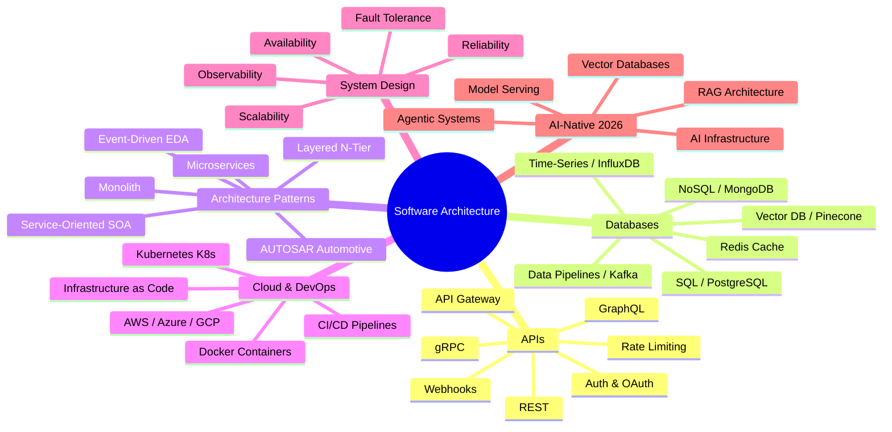
```mermaid
mindmap
  root((Software Architecture))
    APIs
      REST
      GraphQL
      Webhooks
      gRPC
      API Gateway
      Auth & OAuth
      Rate Limiting
    Databases
      SQL / PostgreSQL
      NoSQL / MongoDB
      Time-Series / InfluxDB
      Redis Cache
      Vector DB / Pinecone
      Data Pipelines / Kafka
    Architecture Patterns
      Monolith
      Microservices
      Event-Driven EDA
      Service-Oriented SOA
      Layered N-Tier
      AUTOSAR Automotive
    Cloud & DevOps
      AWS / Azure / GCP
      Docker Containers
      Kubernetes K8s
      CI/CD Pipelines
      Infrastructure as Code
    System Design
      Scalability
      Reliability
      Availability
      Fault Tolerance
      Observability
    AI-Native 2026
      AI Infrastructure
      Model Serving
      Agentic Systems
      Vector Databases
      RAG Architecture
```

---

## ⚡ How Modern Software Works — End-to-End

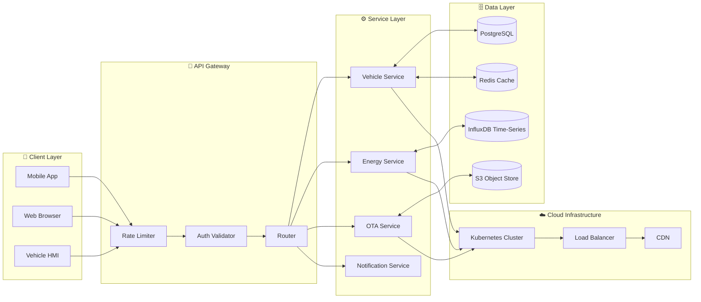
```mermaid
flowchart LR
    subgraph Client["📱 Client Layer"]
        A[Mobile App]
        B[Web Browser]
        C[Vehicle HMI]
    end

    subgraph Gateway["🔀 API Gateway"]
        D[Rate Limiter]
        E[Auth Validator]
        F[Router]
    end

    subgraph Services["⚙️ Service Layer"]
        G[Vehicle Service]
        H[Energy Service]
        I[OTA Service]
        J[Notification Service]
    end

    subgraph Data["🗄️ Data Layer"]
        K[(PostgreSQL)]
        L[(Redis Cache)]
        M[(InfluxDB Time-Series)]
        N[(S3 Object Store)]
    end

    subgraph Infra["☁️ Cloud Infrastructure"]
        O[Kubernetes Cluster]
        P[Load Balancer]
        Q[CDN]
    end

    A & B & C --> D
    D --> E --> F
    F --> G & H & I & J
    G <--> K & L
    H <--> M
    I <--> N
    G & H & I --> O
    O --> P --> Q
```

---

## 🌐 API Ecosystem

### REST API Architecture

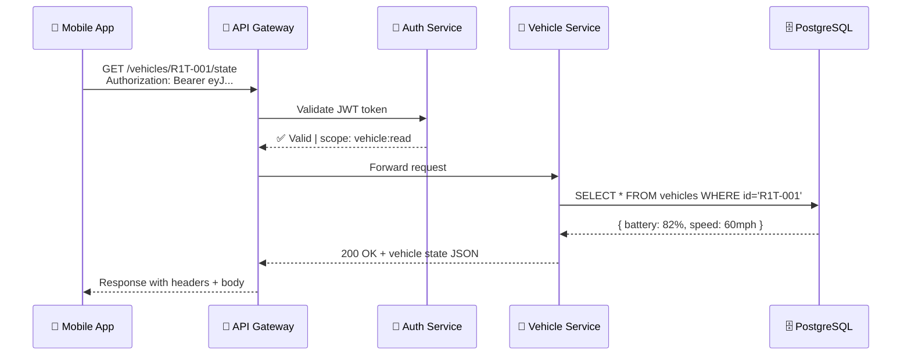
```mermaid
sequenceDiagram
    participant App as 📱 Mobile App
    participant GW as 🔀 API Gateway
    participant Auth as 🔐 Auth Service
    participant VS as 🚗 Vehicle Service
    participant DB as 🗄️ PostgreSQL

    App->>GW: GET /vehicles/R1T-001/state<br/>Authorization: Bearer eyJ...
    GW->>Auth: Validate JWT token
    Auth-->>GW: ✅ Valid | scope: vehicle:read
    GW->>VS: Forward request
    VS->>DB: SELECT * FROM vehicles WHERE id='R1T-001'
    DB-->>VS: { battery: 82%, speed: 60mph }
    VS-->>GW: 200 OK + vehicle state JSON
    GW-->>App: Response with headers + body
```

### REST Verb Reference

| HTTP Method | Action | Endpoint Example | Response |
|-------------|--------|-----------------|----------|
| `GET` | Read resource | `/vehicles/{id}` | 200 + data |
| `POST` | Create resource | `/vehicles/{id}/commands` | 201 + created |
| `PUT` | Full update | `/vehicles/{id}/config` | 200 + updated |
| `PATCH` | Partial update | `/vehicles/{id}/settings` | 200 + patched |
| `DELETE` | Remove resource | `/alerts/{alertId}` | 204 No Content |

### HTTP Status Code Map

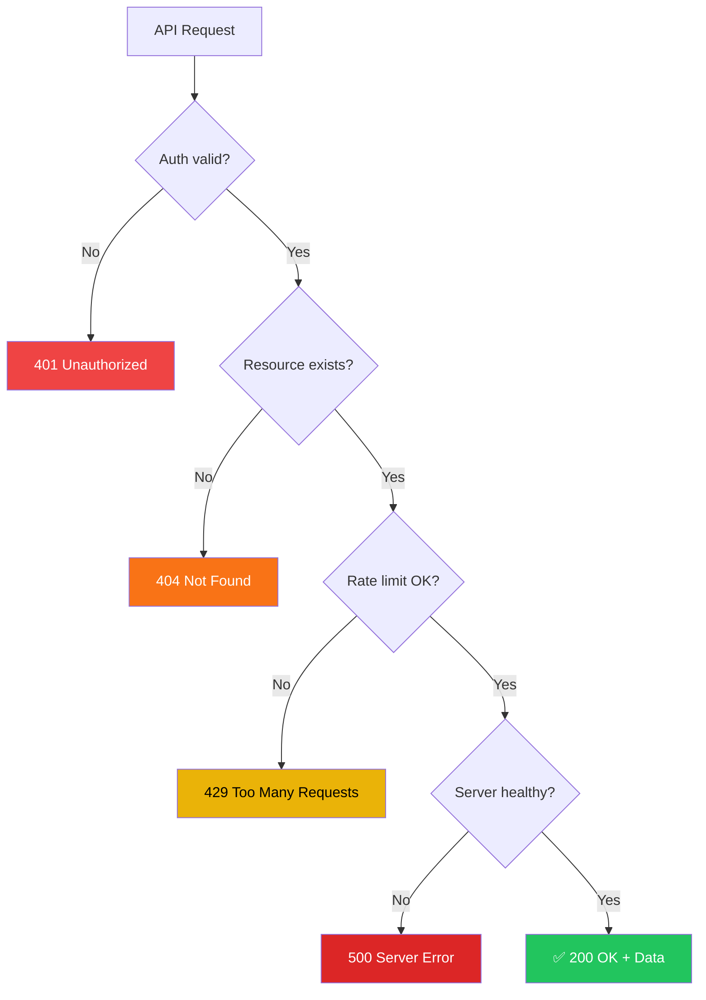
```mermaid
flowchart TD
    Request[API Request] --> Q1{Auth valid?}
    Q1 -->|No| E401[401 Unauthorized]
    Q1 -->|Yes| Q2{Resource exists?}
    Q2 -->|No| E404[404 Not Found]
    Q2 -->|Yes| Q3{Rate limit OK?}
    Q3 -->|No| E429[429 Too Many Requests]
    Q3 -->|Yes| Q4{Server healthy?}
    Q4 -->|No| E500[500 Server Error]
    Q4 -->|Yes| S200[✅ 200 OK + Data]

    style E401 fill:#ef4444,color:#fff
    style E404 fill:#f97316,color:#fff
    style E429 fill:#eab308,color:#000
    style E500 fill:#dc2626,color:#fff
    style S200 fill:#22c55e,color:#fff
```

---

### GraphQL Architecture

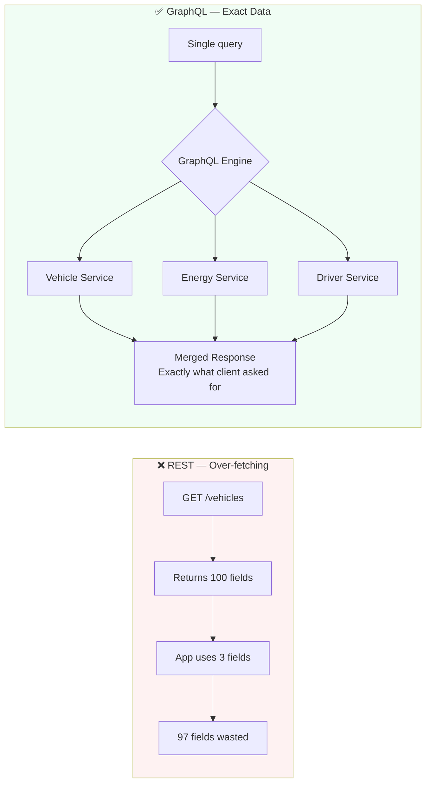
```mermaid
flowchart LR
    subgraph REST_Problem["❌ REST — Over-fetching"]
        R1[GET /vehicles] --> R2[Returns 100 fields]
        R2 --> R3[App uses 3 fields]
        R3 --> R4[97 fields wasted]
    end

    subgraph GQL["✅ GraphQL — Exact Data"]
        G1[Single query] --> G2{GraphQL Engine}
        G2 --> G3[Vehicle Service]
        G2 --> G4[Energy Service]
        G2 --> G5[Driver Service]
        G3 & G4 & G5 --> G6[Merged Response<br/>Exactly what client asked for]
    end

    style REST_Problem fill:#fef2f2
    style GQL fill:#f0fdf4
```

**GraphQL Query Example:**
```graphql
query FleetDashboard {
  vehicle(id: "R1T-001") {
    battery_pct          # only what we need
    range_km
    recent_trips(limit: 5) {
      distance
      duration
      energy_consumed
    }
    driver {
      name
      license_status
    }
  }
}
```

---

### Webhook Architecture

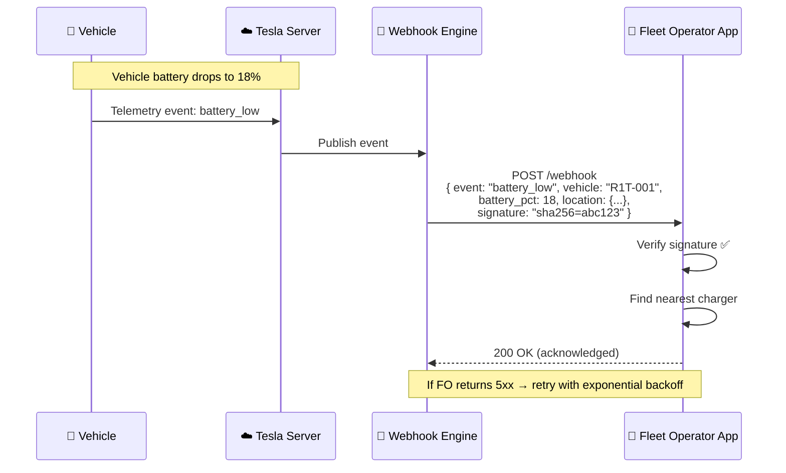
```mermaid
sequenceDiagram
    participant V as 🚗 Vehicle
    participant S as ☁️ Tesla Server
    participant WH as 📡 Webhook Engine
    participant FO as 🏢 Fleet Operator App

    Note over V,S: Vehicle battery drops to 18%

    V->>S: Telemetry event: battery_low
    S->>WH: Publish event
    WH->>FO: POST /webhook<br/>{ event: "battery_low", vehicle: "R1T-001",<br/>  battery_pct: 18, location: {...},<br/>  signature: "sha256=abc123" }
    FO->>FO: Verify signature ✅
    FO->>FO: Find nearest charger
    FO-->>WH: 200 OK (acknowledged)

    Note over WH,FO: If FO returns 5xx → retry with exponential backoff
```

> **Polling vs Webhooks:** Polling = checking every 10 seconds = 8,640 wasted requests/day. Webhooks = instant, zero waste.

---

### OAuth 2.0 Authentication Flow

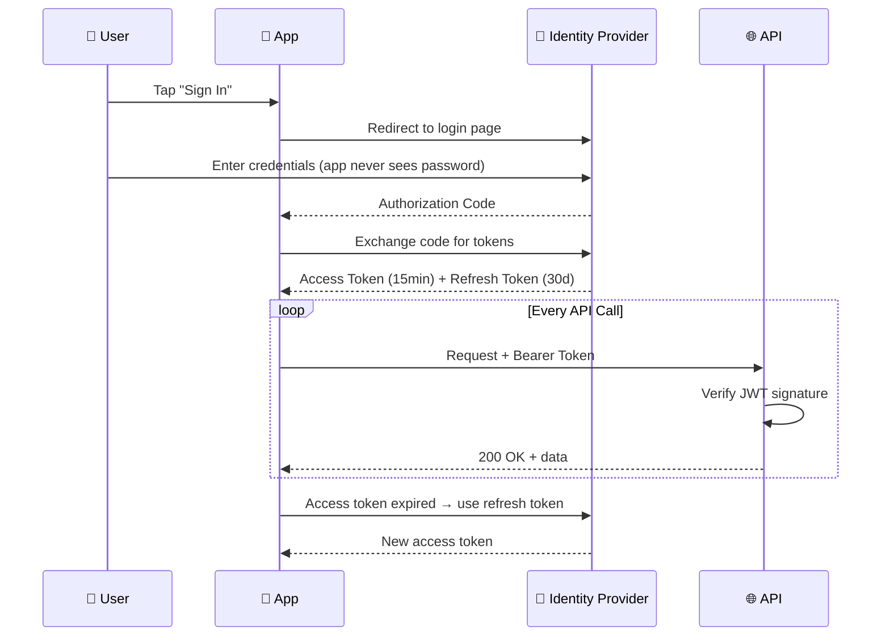
```mermaid
sequenceDiagram
    participant U as 👤 User
    participant App as 📱 App
    participant IDP as 🔐 Identity Provider
    participant API as 🌐 API

    U->>App: Tap "Sign In"
    App->>IDP: Redirect to login page
    U->>IDP: Enter credentials (app never sees password)
    IDP-->>App: Authorization Code
    App->>IDP: Exchange code for tokens
    IDP-->>App: Access Token (15min) + Refresh Token (30d)

    loop Every API Call
        App->>API: Request + Bearer Token
        API->>API: Verify JWT signature
        API-->>App: 200 OK + data
    end

    App->>IDP: Access token expired → use refresh token
    IDP-->>App: New access token
```

### JWT Token Anatomy

```
eyJhbGciOiJSUzI1NiJ9  ←  Header (algorithm)
.
eyJzdWIiOiJ1c2VyXzEyMyIsInNjb3BlIjoidmVoaWNsZTpyZWFkIiwiZXhwIjoxNzQ4NzAzNjAwfQ
←  Payload (claims: user_id, scope, expiry)
.
SflKxwRJSMeKKF2QT4fwpMeJf36P  ←  Signature (verify with public key)
```

| Claim | Value | Meaning |
|-------|-------|---------|
| `sub` | `user_123` | Who the token belongs to |
| `scope` | `vehicle:read` | What they can access |
| `exp` | `1748703600` | When it expires |
| `iat` | `1748700000` | When it was issued |

---

### API Rate Limiting — Token Bucket

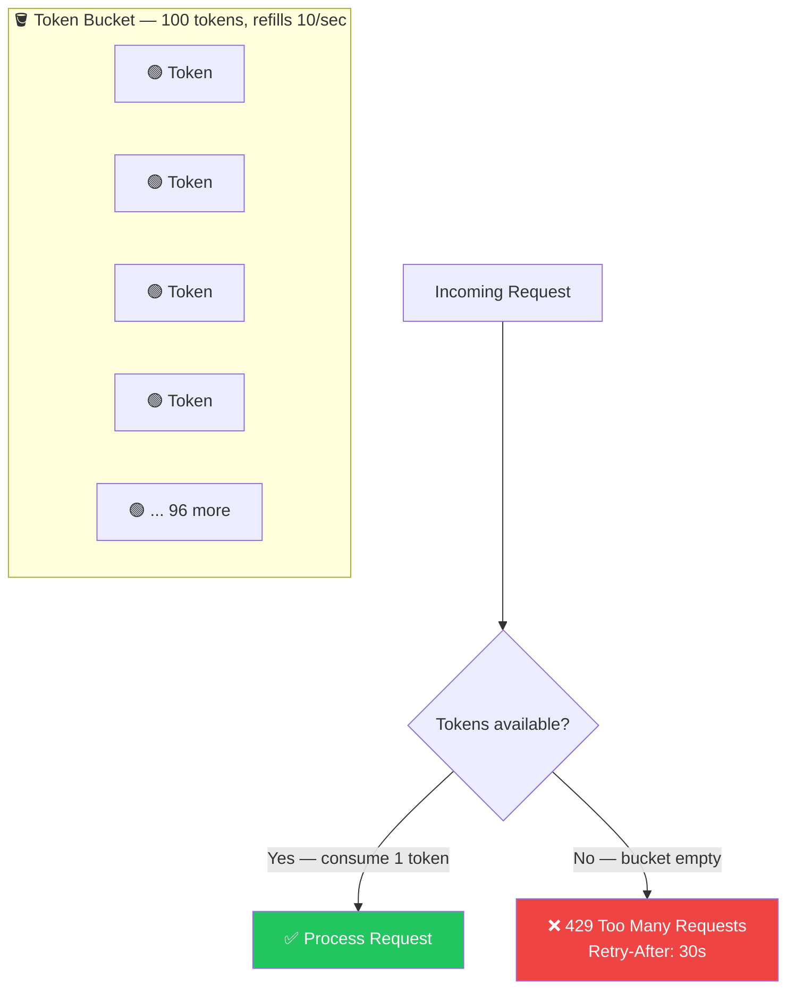
```mermaid
flowchart TD
    subgraph Bucket["🪣 Token Bucket — 100 tokens, refills 10/sec"]
        T1[🟢 Token]
        T2[🟢 Token]
        T3[🟢 Token]
        T4[🟢 Token]
        T5[🟢 ... 96 more]
    end

    R[Incoming Request] --> Q{Tokens available?}
    Q -->|Yes — consume 1 token| P[✅ Process Request]
    Q -->|No — bucket empty| L[❌ 429 Too Many Requests<br/>Retry-After: 30s]

    style P fill:#22c55e,color:#fff
    style L fill:#ef4444,color:#fff
```

---

## 🗄️ Database Ecosystem

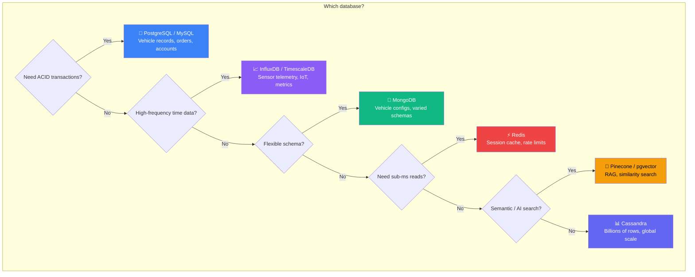
```mermaid
flowchart TD
    subgraph Choose["Which database?"]
        Q1{Need ACID transactions?}
        Q1 -->|Yes| SQL[🐘 PostgreSQL / MySQL<br/>Vehicle records, orders, accounts]
        Q1 -->|No| Q2{High-frequency time data?}
        Q2 -->|Yes| TS[📈 InfluxDB / TimescaleDB<br/>Sensor telemetry, IoT, metrics]
        Q2 -->|No| Q3{Flexible schema?}
        Q3 -->|Yes| DOC[📄 MongoDB<br/>Vehicle configs, varied schemas]
        Q3 -->|No| Q4{Need sub-ms reads?}
        Q4 -->|Yes| KV[⚡ Redis<br/>Session cache, rate limits]
        Q4 -->|No| Q5{Semantic / AI search?}
        Q5 -->|Yes| VEC[🔮 Pinecone / pgvector<br/>RAG, similarity search]
        Q5 -->|No| WIDE[📊 Cassandra<br/>Billions of rows, global scale]
    end

    style SQL fill:#3b82f6,color:#fff
    style TS fill:#8b5cf6,color:#fff
    style DOC fill:#10b981,color:#fff
    style KV fill:#ef4444,color:#fff
    style VEC fill:#f59e0b,color:#000
    style WIDE fill:#6366f1,color:#fff
```

### Database Comparison Matrix

| Feature | PostgreSQL | MongoDB | Redis | InfluxDB | Cassandra | pgvector |
|---------|-----------|---------|-------|----------|-----------|---------|
| **Data model** | Relational | Document | Key-Value | Time-Series | Wide-Column | Relational + Vector |
| **ACID** | ✅ Full | ⚠️ Document | ❌ | ❌ | ⚠️ Eventual | ✅ Full |
| **Scale** | Vertical | Horizontal | Horizontal | Horizontal | Horizontal | Vertical |
| **Query** | SQL | MongoDB Query | Key lookup | InfluxQL | CQL | SQL + ANN |
| **Best for** | Accounts, orders | Flexible configs | Caching, sessions | IoT sensors | Event logs | AI/semantic search |
| **Used by** | Rivian, TSMC | MongoDB Atlas | Tesla, NVIDIA | Siemens | Netflix, Apple | Rivian AI, TSMC |

### Data Flow Architecture

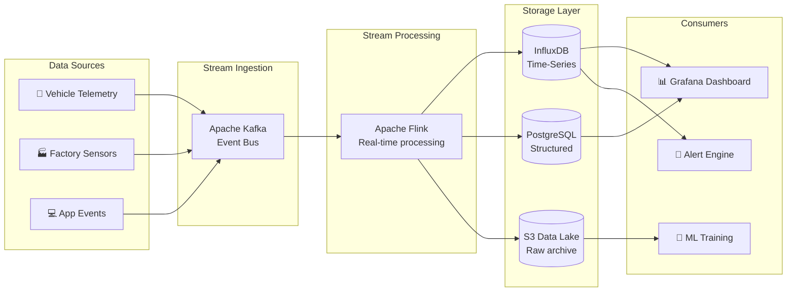
```mermaid
flowchart LR
    subgraph Sources["Data Sources"]
        V1[🚗 Vehicle Telemetry]
        V2[🏭 Factory Sensors]
        V3[💻 App Events]
    end

    subgraph Ingestion["Stream Ingestion"]
        K[Apache Kafka<br/>Event Bus]
    end

    subgraph Processing["Stream Processing"]
        SP[Apache Flink<br/>Real-time processing]
    end

    subgraph Storage["Storage Layer"]
        IDB[(InfluxDB<br/>Time-Series)]
        PG[(PostgreSQL<br/>Structured)]
        S3[(S3 Data Lake<br/>Raw archive)]
    end

    subgraph Consumption["Consumers"]
        D[📊 Grafana Dashboard]
        ML[🤖 ML Training]
        A[🚨 Alert Engine]
    end

    V1 & V2 & V3 --> K
    K --> SP
    SP --> IDB & PG & S3
    IDB --> D & A
    S3 --> ML
    PG --> D
```

---

## 🏛️ Software Architecture Patterns

### Pattern Decision Tree

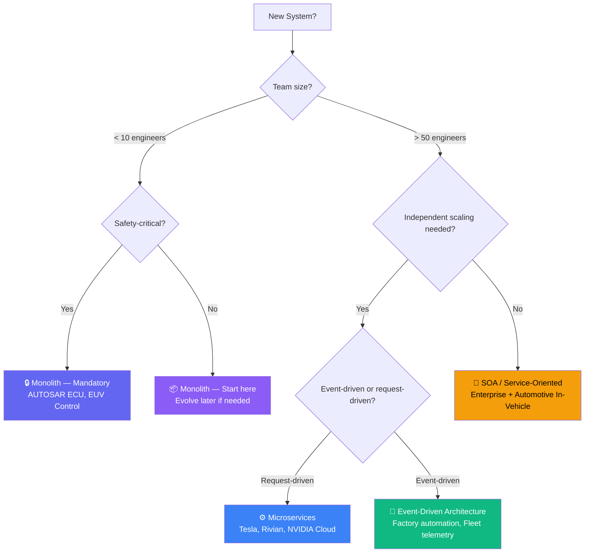
```mermaid
flowchart TD
    Start[New System?] --> Q1{Team size?}
    Q1 -->|< 10 engineers| Q2{Safety-critical?}
    Q1 -->|> 50 engineers| Q3{Independent scaling needed?}

    Q2 -->|Yes| MONO_HARD[🔒 Monolith — Mandatory<br/>AUTOSAR ECU, EUV Control]
    Q2 -->|No| MONO_EASY[📦 Monolith — Start here<br/>Evolve later if needed]

    Q3 -->|Yes| Q4{Event-driven or request-driven?}
    Q3 -->|No| SOA_BOX[🏢 SOA / Service-Oriented<br/>Enterprise + Automotive In-Vehicle]

    Q4 -->|Request-driven| MICRO[⚙️ Microservices<br/>Tesla, Rivian, NVIDIA Cloud]
    Q4 -->|Event-driven| EDA[📡 Event-Driven Architecture<br/>Factory automation, Fleet telemetry]

    style MONO_HARD fill:#6366f1,color:#fff
    style MONO_EASY fill:#8b5cf6,color:#fff
    style MICRO fill:#3b82f6,color:#fff
    style EDA fill:#10b981,color:#fff
    style SOA_BOX fill:#f59e0b,color:#000
```

---

### Monolith Architecture

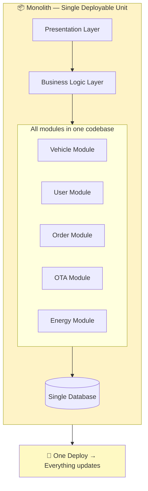
```mermaid
flowchart TB
    subgraph MONO["📦 Monolith — Single Deployable Unit"]
        direction TB
        UI[Presentation Layer]
        BL[Business Logic Layer]

        subgraph Modules["All modules in one codebase"]
            VM[Vehicle Module]
            UM[User Module]
            OM[Order Module]
            OTA[OTA Module]
            EM[Energy Module]
        end

        DB[(Single Database)]
        UI --> BL --> Modules --> DB
    end

    DEP[🚀 One Deploy → Everything updates]
    MONO --> DEP

    style MONO fill:#fef3c7
    style DEP fill:#fef9c3
```

**When to use:** Small teams, safety-critical systems (ECUs, EUV machines), early-stage products.

---

### Microservices Architecture

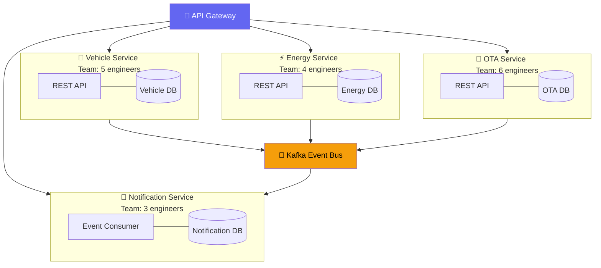
```mermaid
flowchart TB
    GW[🔀 API Gateway] --> VS & ES & OS & NS

    subgraph VS["🚗 Vehicle Service<br/>Team: 5 engineers"]
        V_API[REST API]
        V_DB[(Vehicle DB)]
        V_API --- V_DB
    end

    subgraph ES["⚡ Energy Service<br/>Team: 4 engineers"]
        E_API[REST API]
        E_DB[(Energy DB)]
        E_API --- E_DB
    end

    subgraph OS["📡 OTA Service<br/>Team: 6 engineers"]
        O_API[REST API]
        O_DB[(OTA DB)]
        O_API --- O_DB
    end

    subgraph NS["🔔 Notification Service<br/>Team: 3 engineers"]
        N_API[Event Consumer]
        N_DB[(Notification DB)]
        N_API --- N_DB
    end

    KAFKA[📨 Kafka Event Bus]
    VS & ES & OS --> KAFKA --> NS

    style GW fill:#6366f1,color:#fff
    style KAFKA fill:#f59e0b,color:#000
```

**Each service:** Independent deploy · Own database · Own team · Own release cadence.

---

### Event-Driven Architecture

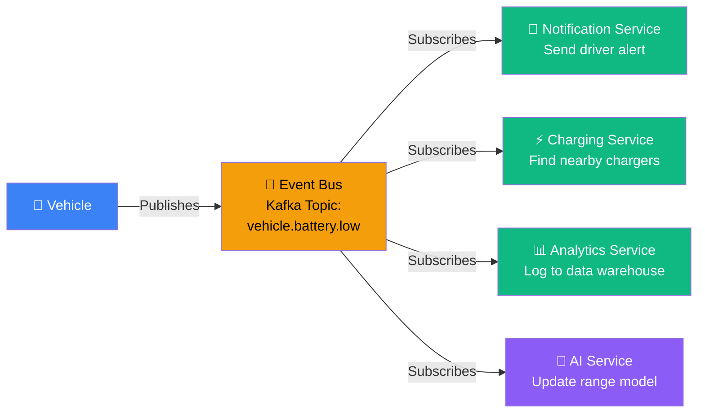
```mermaid
flowchart LR
    V[🚗 Vehicle] -->|Publishes| EB[📨 Event Bus\nKafka Topic:\nvehicle.battery.low]

    EB -->|Subscribes| N[🔔 Notification Service\nSend driver alert]
    EB -->|Subscribes| CS[⚡ Charging Service\nFind nearby chargers]
    EB -->|Subscribes| AN[📊 Analytics Service\nLog to data warehouse]
    EB -->|Subscribes| AI[🤖 AI Service\nUpdate range model]

    style V fill:#3b82f6,color:#fff
    style EB fill:#f59e0b,color:#000
    style N fill:#10b981,color:#fff
    style CS fill:#10b981,color:#fff
    style AN fill:#10b981,color:#fff
    style AI fill:#8b5cf6,color:#fff
```

> **Key insight:** Vehicle service never changes when new consumers are added. Zero coupling.

---

### AUTOSAR SOA — In-Vehicle Architecture

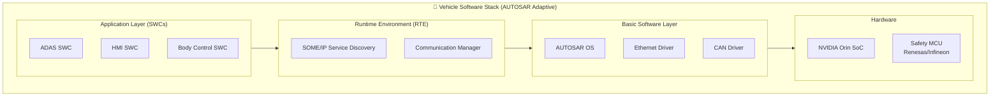
```mermaid
flowchart TB
    subgraph Vehicle["🚗 Vehicle Software Stack (AUTOSAR Adaptive)"]
        subgraph App["Application Layer (SWCs)"]
            ADAS[ADAS SWC]
            HMI[HMI SWC]
            BODY[Body Control SWC]
        end

        subgraph RTE["Runtime Environment (RTE)"]
            SD[SOME/IP Service Discovery]
            COM[Communication Manager]
        end

        subgraph BSW["Basic Software Layer"]
            OS[AUTOSAR OS]
            ETH[Ethernet Driver]
            CAN[CAN Driver]
        end

        subgraph HW["Hardware"]
            ORIN[NVIDIA Orin SoC]
            MCU[Safety MCU\nRenesas/Infineon]
        end

        App --> RTE --> BSW --> HW
    end
```

---

### Layered Architecture — Cloud vs Embedded

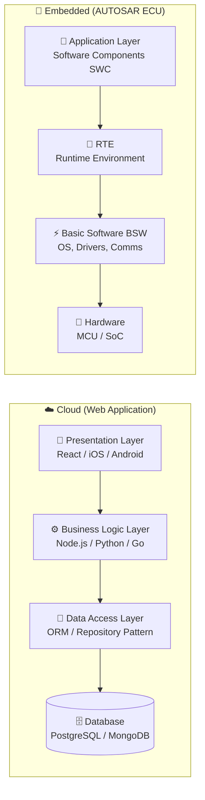
```mermaid
flowchart LR
    subgraph Cloud["☁️ Cloud (Web Application)"]
        direction TB
        P1[🎨 Presentation Layer\nReact / iOS / Android]
        P2[⚙️ Business Logic Layer\nNode.js / Python / Go]
        P3[🔌 Data Access Layer\nORM / Repository Pattern]
        P4[(🗄️ Database\nPostgreSQL / MongoDB)]
        P1 --> P2 --> P3 --> P4
    end

    subgraph ECU["🔧 Embedded (AUTOSAR ECU)"]
        direction TB
        E1[📱 Application Layer\nSoftware Components SWC]
        E2[🔀 RTE\nRuntime Environment]
        E3[⚡ Basic Software BSW\nOS, Drivers, Comms]
        E4[💾 Hardware\nMCU / SoC]
        E1 --> E2 --> E3 --> E4
    end
```

---

## ☁️ Cloud Architecture

### AWS Core Services Map

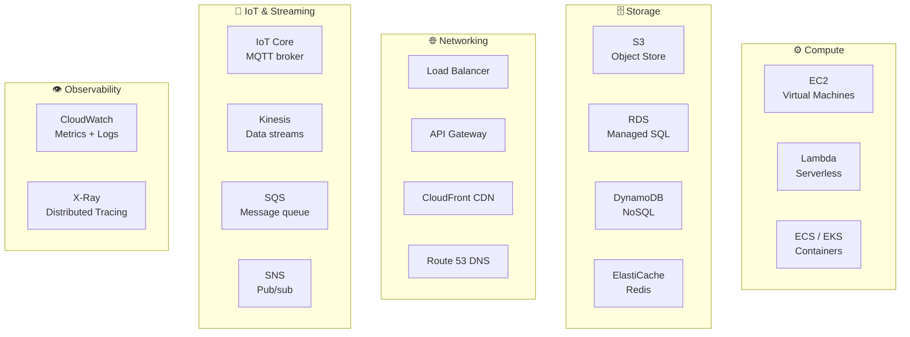
```mermaid
flowchart TB
    subgraph Compute["⚙️ Compute"]
        EC2[EC2\nVirtual Machines]
        LAMBDA[Lambda\nServerless]
        ECS[ECS / EKS\nContainers]
    end

    subgraph Storage["🗄️ Storage"]
        S3[S3\nObject Store]
        RDS[RDS\nManaged SQL]
        DYNAMO[DynamoDB\nNoSQL]
        ELASTIC[ElastiCache\nRedis]
    end

    subgraph Networking["🌐 Networking"]
        ALB[Load Balancer]
        APIGW[API Gateway]
        CF[CloudFront CDN]
        R53[Route 53 DNS]
    end

    subgraph IoT["📡 IoT & Streaming"]
        IOT[IoT Core\nMQTT broker]
        KINESIS[Kinesis\nData streams]
        SQS[SQS\nMessage queue]
        SNS[SNS\nPub/sub]
    end

    subgraph Observability["👁️ Observability"]
        CW[CloudWatch\nMetrics + Logs]
        XRAY[X-Ray\nDistributed Tracing]
    end
```

### Kubernetes Cluster Architecture

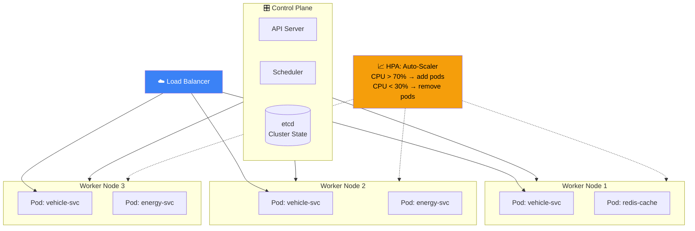
```mermaid
flowchart TB
    subgraph CP["🎛️ Control Plane"]
        API_SRV[API Server]
        SCHED[Scheduler]
        ETCD[(etcd\nCluster State)]
    end

    subgraph N1["Worker Node 1"]
        P1[Pod: vehicle-svc]
        P2[Pod: redis-cache]
    end

    subgraph N2["Worker Node 2"]
        P3[Pod: vehicle-svc]
        P4[Pod: energy-svc]
    end

    subgraph N3["Worker Node 3"]
        P5[Pod: vehicle-svc]
        P6[Pod: energy-svc]
    end

    LB[☁️ Load Balancer] --> P1 & P3 & P5
    CP --> N1 & N2 & N3

    HPA[📈 HPA: Auto-Scaler\nCPU > 70% → add pods\nCPU < 30% → remove pods]
    HPA -.-> N1 & N2 & N3

    style LB fill:#3b82f6,color:#fff
    style HPA fill:#f59e0b,color:#000
```

### CI/CD Pipeline

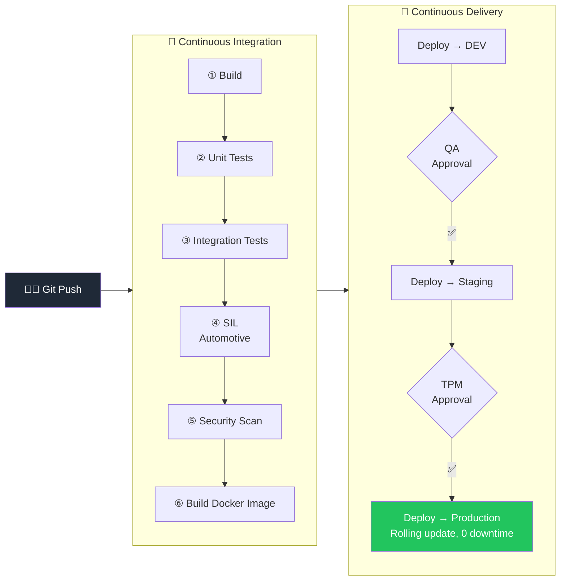
```mermaid
flowchart LR
    GIT[👨‍💻 Git Push] --> CI

    subgraph CI["🔄 Continuous Integration"]
        BUILD[① Build] --> TEST[② Unit Tests] --> INT[③ Integration Tests] --> SIL[④ SIL\nAutomotive] --> SCAN[⑤ Security Scan] --> IMG[⑥ Build Docker Image]
    end

    CI --> CD

    subgraph CD["🚀 Continuous Delivery"]
        DEV[Deploy → DEV] --> QA{QA\nApproval}
        QA -->|✅| STG[Deploy → Staging]
        STG --> PM{TPM\nApproval}
        PM -->|✅| PROD[Deploy → Production\nRolling update, 0 downtime]
    end

    style GIT fill:#1f2937,color:#fff
    style PROD fill:#22c55e,color:#fff
```

---

## 🏭 Industry Architecture Examples

### Tesla Connected Vehicle Platform

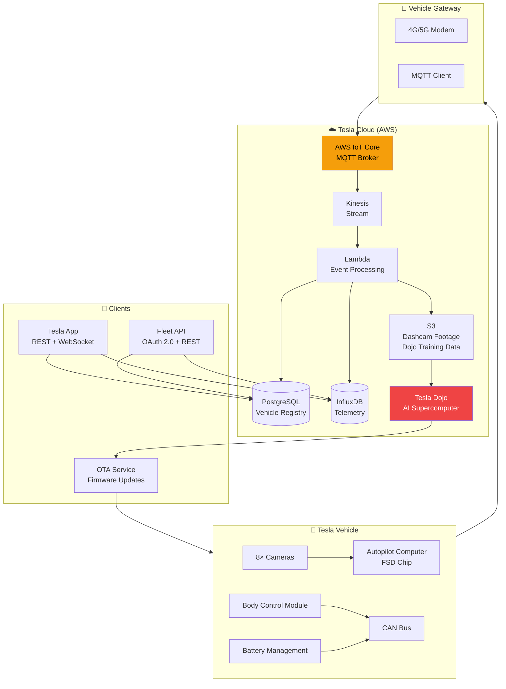
```mermaid
flowchart TB
    subgraph Vehicle["🚗 Tesla Vehicle"]
        AP[Autopilot Computer\nFSD Chip]
        BCM[Body Control Module]
        BMS[Battery Management]
        CAM[8× Cameras]
        CAM --> AP
        BCM & BMS --> CAN[CAN Bus]
    end

    subgraph Gateway["🔀 Vehicle Gateway"]
        CELL[4G/5G Modem]
        MQTT_C[MQTT Client]
    end

    subgraph Cloud["☁️ Tesla Cloud (AWS)"]
        IOT_CORE[AWS IoT Core\nMQTT Broker]
        KINESIS2[Kinesis\nStream]
        LAMBDA2[Lambda\nEvent Processing]
        S3_2[S3\nDashcam Footage\nDojo Training Data]
        PG2[(PostgreSQL\nVehicle Registry)]
        IDB2[(InfluxDB\nTelemetry)]
        DOJO[Tesla Dojo\nAI Supercomputer]
    end

    subgraph Clients["📱 Clients"]
        APP[Tesla App\nREST + WebSocket]
        FLEET[Fleet API\nOAuth 2.0 + REST]
        OTA_SVC[OTA Service\nFirmware Updates]
    end

    Vehicle --> Gateway --> IOT_CORE
    IOT_CORE --> KINESIS2 --> LAMBDA2
    LAMBDA2 --> PG2 & IDB2 & S3_2
    S3_2 --> DOJO
    DOJO --> OTA_SVC --> Vehicle

    APP & FLEET --> PG2 & IDB2

    style DOJO fill:#ef4444,color:#fff
    style IOT_CORE fill:#f59e0b,color:#000
```

---

### NVIDIA AI Infrastructure Platform

```mermaid
flowchart TB
    subgraph Training["🧠 AI Training (DGX SuperPOD)"]
        DGX[32× DGX H100 Nodes\n256× H100 GPUs\nNVLink 3.2 Tbps]
        LUSTRE[Lustre Parallel FS\n200 GB/s read bandwidth]
        IB[InfiniBand HDR\n200 Gbps node interconnect]
        DGX --- LUSTRE
        DGX --- IB
    end

    subgraph ModelReg["📦 Model Registry"]
        NGC[NVIDIA NGC\nContainer Registry\nREST API]
    end

    subgraph Serving["⚡ Inference Serving"]
        TRITON[Triton Inference Server\ngRPC + HTTP endpoints]
        TENSORRT[TensorRT Engine\nINT8 Quantization]
        TRITON --> TENSORRT
    end

    subgraph InVehicle["🚗 In-Vehicle (Orin SoC)"]
        ORIN[Orin SoC\n254 TOPS\n30fps @ 20ms latency]
    end

    Training --> ModelReg
    ModelReg --> Serving
    ModelReg -->|OTA| InVehicle
    Serving --> CLOUD_INF[Cloud Inference API\n50ms SLA]

    style DGX fill:#76b900,color:#fff
    style ORIN fill:#76b900,color:#fff
    style TRITON fill:#1a1a1a,color:#fff
```

---

### Semiconductor Manufacturing Data Flow (TSMC)

```mermaid
flowchart LR
    subgraph Fab["🏭 TSMC Fab — Wafer Processing"]
        LITHO[ASML EUV\nLithography Machine]
        ETCH[Lam Research\nEtch Tools]
        CVD[Applied Materials\nCVD Deposition]
        INSPECT[KLA\nWafer Inspection]

        LITHO --> ETCH --> CVD --> INSPECT
    end

    subgraph MES["📊 Manufacturing Execution System"]
        LOT[Lot Tracking\nOracle DB]
        SPC[SPC Engine\nStatistical Process Control]
        YIELD[Yield Analytics\nSpark + Redshift]
    end

    subgraph Portal["🌐 Customer Portal"]
        API_GW[API Gateway\nmTLS Auth]
        GQL[GraphQL API]
        REST2[REST API]
    end

    subgraph Customers["💻 Fabless Customers"]
        APPLE[Apple\niPhone SoC]
        AMD[AMD\nEPYC CPU]
        NVIDIA2[NVIDIA\nH100 GPU]
    end

    Fab -->|Equipment telemetry| MES
    MES --> Portal
    API_GW --> GQL & REST2
    Portal --> APPLE & AMD & NVIDIA2

    INSPECT -->|Defect images| VDB[(Vector DB\nDefect Classification\nAI Similarity Search)]

    style LITHO fill:#6366f1,color:#fff
    style VDB fill:#8b5cf6,color:#fff
```

---

### Smart Factory Architecture (Siemens MindSphere)

```mermaid
flowchart TB
    subgraph Factory["🏭 Factory Floor"]
        PLC[PLCs\nSiemens S7]
        ROBOT[Industrial Robots\nKuka / Fanuc]
        SENSOR[IoT Sensors\nTemperature, Pressure, Vibration]
        CAMERA[Vision Systems\nQuality Inspection]
    end

    subgraph Edge["📡 Edge Layer"]
        EDGE_GW[Siemens SIMATIC\nEdge Gateway]
        MQTT2[MQTT Broker\nLocal]
        EDGE_AI[Edge AI\nAnomaly Detection]
    end

    subgraph MindSphere["☁️ Siemens MindSphere (Azure)"]
        IOT2[IoT Ingest\nKafka]
        TS_DB[(TimescaleDB\nSensor Data)]
        TWIN[Digital Twin\nNVIDIA Omniverse]
        ANALYTICS[Analytics Engine\nApache Spark]
    end

    subgraph Applications["📲 Applications"]
        OEE[OEE Dashboard\nOverall Equipment Effectiveness]
        PRED[Predictive Maintenance\nML Model API]
        ERP[SAP ERP Integration\nWebhooks]
    end

    Factory --> Edge --> MindSphere
    IOT2 --> TS_DB & TWIN
    TS_DB --> ANALYTICS
    ANALYTICS --> OEE & PRED
    PRED --> ERP

    style TWIN fill:#76b900,color:#fff
    style PRED fill:#8b5cf6,color:#fff
```

---

## 🤖 AI-Native Architecture (2026)

### AI Agent System

```mermaid
flowchart TB
    U[👤 User / Trigger] --> ORCH

    subgraph ORCH["🧠 AI Orchestrator (LLM + Tool Calling)"]
        PLAN[Planning:\nDecompose task into steps]
        REASON[Reasoning:\nInterpret tool results]
        DECIDE[Decision:\nNext action or final answer]
        PLAN --> REASON --> DECIDE --> PLAN
    end

    ORCH --> TOOLS

    subgraph TOOLS["🔧 Tool Layer (APIs)"]
        SQL_T[🗄️ SQL Query Tool]
        REST_T[🌐 REST API Tool]
        CODE_T[💻 Code Execution Tool]
        SEARCH_T[🔍 Vector Search Tool]
        NOTIFY_T[📨 Notification Tool]
    end

    TOOLS --> BACKENDS

    subgraph BACKENDS["💾 Data & Systems"]
        PG3[(PostgreSQL)]
        VDB2[(Vector DB\nPinecone)]
        EXT[External APIs]
        K8S2[Kubernetes Jobs]
    end

    ORCH --> OUT[📋 Final Output\nAudit Log of Every Decision]

    style ORCH fill:#6366f1,color:#fff
    style OUT fill:#10b981,color:#fff
```

---

### RAG Architecture (Retrieval-Augmented Generation)

```mermaid
flowchart LR
    subgraph Index["📚 Indexing Pipeline (One-time)"]
        DOCS[Technical Docs\nPDFs, Specs, Manuals]
        CHUNK[Text Chunker\n512 token chunks]
        EMBED[Embedding Model\ntext → 1536-dim vector]
        VDB3[(Vector Database\nPinecone / pgvector)]
        DOCS --> CHUNK --> EMBED --> VDB3
    end

    subgraph Query["🔍 Query Pipeline (Real-time)"]
        Q[User Question] --> QEMBED[Embed Question\n→ query vector]
        QEMBED --> SEARCH[Similarity Search\nTop-5 nearest chunks]
        VDB3 --> SEARCH
        SEARCH --> CONTEXT[Retrieved Context]
        CONTEXT --> LLM[LLM\nClaude / GPT-4]
        Q --> LLM
        LLM --> ANS[✅ Grounded Answer\nwith source citations]
    end

    style VDB3 fill:#8b5cf6,color:#fff
    style LLM fill:#f59e0b,color:#000
    style ANS fill:#22c55e,color:#fff
```

---

### Model Serving Architecture

```mermaid
flowchart TB
    subgraph Training["Training"]
        DATA[Raw Data\n10PB dashcam] --> TRAIN[DGX H100 Cluster]
        TRAIN --> MODEL[Model Artifact\nPyTorch .pt]
        MODEL --> REGISTRY[Model Registry\nVersion + Metrics]
    end

    subgraph Serving["Inference Serving"]
        REGISTRY --> TRITON2[Triton Inference Server]
        TRITON2 --> TRT[TensorRT\nFP16/INT8 optimized]
        TRT --> BATCH[Request Batcher\nMax throughput]
        BATCH --> GPU_INF[GPU Inference\nA100 / H100]
    end

    subgraph InVehicle2["In-Vehicle Deployment"]
        REGISTRY -->|OTA Update| OTA2[OTA Service]
        OTA2 --> ORIN2[NVIDIA Orin SoC\n30fps, 20ms latency]
    end

    subgraph Monitoring["Monitoring"]
        GPU_INF --> PROM[Prometheus\nLatency, throughput]
        ORIN2 --> SHADOW[Shadow Mode\nCompare old vs new model]
    end
```

---

## 🔭 System Design Principles

### Scalability Patterns

```mermaid
flowchart LR
    subgraph ScaleUp["⬆️ Vertical (Scale Up)"]
        S1[Server\n4 CPU, 16GB RAM] -->|Upgrade| S2[Server\n128 CPU, 2TB RAM]
        S2 --> CEIL[❌ Has ceiling\nExpensive]
    end

    subgraph ScaleOut["➡️ Horizontal (Scale Out)"]
        LB2[Load Balancer] --> SRV1[Server]
        LB2 --> SRV2[Server]
        LB2 --> SRV3[Server]
        LB2 --> SRV4[Server ...]
        SRV4 --> UNLIM[✅ Unlimited scale\nAdd servers as needed]
    end

    style CEIL fill:#ef4444,color:#fff
    style UNLIM fill:#22c55e,color:#fff
```

### Availability Tiers

| SLA | Downtime / Year | Use Case | How to Achieve |
|-----|----------------|----------|---------------|
| 99% | 3.65 days | Internal tools | Single server |
| 99.9% | 8.7 hours | Consumer apps | Load balancer + 2 servers |
| 99.99% | 52 minutes | Vehicle command API | Multi-AZ + auto-failover |
| 99.999% | 5 minutes | EUV machine control | Triple redundancy + hardware |

### Observability — The Four Golden Signals

```mermaid
quadrantChart
    title Four Golden Signals (Site Reliability Engineering)
    x-axis "Harder to alert on" --> "Easier to alert on"
    y-axis "System health indicator" --> "User experience indicator"
    quadrant-1 Primary Alerts
    quadrant-2 Supporting Metrics
    quadrant-3 Capacity Planning
    quadrant-4 Proactive Monitoring
    Latency: [0.7, 0.9]
    Error Rate: [0.85, 0.85]
    Traffic: [0.3, 0.4]
    Saturation: [0.2, 0.6]
```

```mermaid
flowchart LR
    subgraph Signals["👁️ Observability — Three Pillars"]
        subgraph Metrics["📊 Metrics\nPrometheus + Grafana"]
            M1[Request rate: 10k/sec]
            M2[Error rate: 0.01%]
            M3[Latency p99: 45ms]
            M4[CPU: 62%]
        end

        subgraph Logs["📝 Logs\nELK Stack"]
            L1[2026-05-31 14:32:01 ERROR]
            L2[VehicleService: NullPointerException]
            L3[vehicle_id: R1T-001]
            L4[Stack trace: line 142]
        end

        subgraph Traces["🔍 Distributed Traces\nJaeger"]
            T1[Request ID: abc-123]
            T2[→ API Gateway: 5ms]
            T3[→ Vehicle Service: 35ms]
            T4[→ Database query: 28ms ⚠️]
        end
    end

    Signals --> ALERT[🚨 PagerDuty\nOn-call alert]
    ALERT --> RESOLUTION[📋 Post-Mortem\nRoot cause → fix → prevent]
```

---

## 🎯 Complete Learning Roadmap

```mermaid
flowchart TB
    subgraph P1["Phase 1 — Fundamentals (Week 1–2)"]
        F1[Client–Server Model]
        F2[HTTP Protocols]
        F3[Request–Response Cycle]
        F4[JSON / Protobuf / XML]
        F1 --> F2 --> F3 --> F4
    end

    subgraph P2["Phase 2 — APIs (Week 3–5)"]
        A1[REST APIs]
        A2[GraphQL]
        A3[Webhooks]
        A4[API Gateway]
        A5[OAuth 2.0 + JWT]
        A6[Rate Limiting]
        A1 --> A2 --> A3 --> A4 --> A5 --> A6
    end

    subgraph P3["Phase 3 — Databases (Week 6–8)"]
        D1[SQL + ACID]
        D2[NoSQL types]
        D3[Data Modeling]
        D4[Data Pipelines + Kafka]
        D1 --> D2 --> D3 --> D4
    end

    subgraph P4["Phase 4 — Architecture (Week 9–11)"]
        AR1[Monolith]
        AR2[Microservices]
        AR3[Event-Driven]
        AR4[SOA + AUTOSAR]
        AR1 --> AR2 --> AR3 --> AR4
    end

    subgraph P5["Phase 5 — Cloud (Week 12–14)"]
        C1[AWS/Azure Core Services]
        C2[Docker Containers]
        C3[Kubernetes]
        C4[CI/CD Pipelines]
        C1 --> C2 --> C3 --> C4
    end

    subgraph P6["Phase 6 — System Design (Week 15–17)"]
        S1[Scalability]
        S2[Reliability + Circuit Breakers]
        S3[Availability + SLAs]
        S4[Fault Tolerance]
        S5[Observability]
        S1 --> S2 --> S3 --> S4 --> S5
    end

    subgraph P7["Phase 7 — AI Era (Week 18–20)"]
        AI1[AI Infrastructure + GPUs]
        AI2[Model Serving + Triton]
        AI3[Agentic Systems]
        AI4[AI APIs + LLM Integration]
        AI5[Vector DBs + RAG]
        AI1 --> AI2 --> AI3 --> AI4 --> AI5
    end

    P1 --> P2 --> P3 --> P4 --> P5 --> P6 --> P7

    style P1 fill:#dbeafe
    style P2 fill:#dcfce7
    style P3 fill:#fef9c3
    style P4 fill:#fce7f3
    style P5 fill:#ede9fe
    style P6 fill:#ffedd5
    style P7 fill:#ecfdf5
```

---

## 🎖️ TPM Skill Mapping Matrix

### Architecture Decisions a TPM Owns

| Architecture Decision | TPM Responsibility | Key Questions to Ask |
|----------------------|-------------------|---------------------|
| **REST vs GraphQL** | API design review | Who are the consumers? How diverse are their data needs? |
| **Monolith vs Microservices** | Architecture review board | Team size? Release independence needed? |
| **SQL vs NoSQL** | Data architecture review | ACID needed? Scale requirements? Schema stability? |
| **Polling vs Webhooks** | Integration design | Latency tolerance? Partner system availability? |
| **K8s vs Serverless** | Platform decision | Traffic predictability? Ops maturity? |
| **Multi-region vs Single-region** | Availability SLA | RTO/RPO requirements? Compliance? Cost? |

### TPM Impact by Phase

```mermaid
flowchart LR
    subgraph TPM_Work["👩‍💼 TPM Activities by Architecture Domain"]
        subgraph APIs_T["APIs"]
            T1[API contract reviews]
            T2[Partner integration SLAs]
            T3[Breaking change management]
            T4[Rate limit tier governance]
        end

        subgraph DB_T["Databases"]
            T5[Schema migration planning]
            T6[Data retention policies]
            T7[Compliance audit trails]
            T8[Pipeline SLA ownership]
        end

        subgraph Arch_T["Architecture"]
            T9[ADR ownership]
            T10[Service dependency maps]
            T11[OTA release gates]
            T12[Incident retrospectives]
        end

        subgraph Cloud_T["Cloud"]
            T13[Cost per vehicle tracking]
            T14[Vendor SLA management]
            T15[Deployment freeze process]
            T16[CI/CD health metrics]
        end

        subgraph AI_T["AI Era"]
            T17[GPU allocation programs]
            T18[Model deployment gates]
            T19[AI API data privacy review]
            T20[Agent audit log requirements]
        end
    end
```

### Interview Question Cheat Sheet

| Domain | Question | TPM Answer Framework |
|--------|----------|---------------------|
| REST API | "Team can't agree on API schema" | Consumer-first design → OpenAPI spec → versioning → time-box |
| Microservices | "Should we break up the monolith?" | Team size + release independence + scaling needs = decision matrix |
| Databases | "SQL vs NoSQL for vehicle telemetry?" | ACID needed? → No → Write frequency? → 10Hz × 1M vehicles → InfluxDB |
| Availability | "What SLA do we need?" | Map to: downtime tolerance × revenue impact × safety criticality |
| CI/CD | "Deploy takes 3 hours" | Identify bottleneck phase → parallelize → target: sub-30 min |
| OTA | "Rollout shows 5% failure rate" | Auto-pause threshold → rollback decision tree → incident process |
| AI | "Model latency is 200ms, budget is 50ms" | Quantization (INT8) → TensorRT → batching → hardware profile |

---

## 🏗️ GitHub Portfolio — 10 Projects

```mermaid
gantt
    title Portfolio Build Roadmap (20 Weeks)
    dateFormat  YYYY-MM-DD
    section Beginner
    EV Charging Finder API       :p1, 2026-06-01, 14d
    Vehicle Telemetry Simulator  :p2, after p1, 14d
    OBD-II Fault Decoder API     :p3, after p2, 14d
    section Intermediate
    Semiconductor Yield API      :p4, after p3, 14d
    EV Fleet Microservices       :p5, after p4, 14d
    OTA Update System            :p6, after p5, 14d
    section Advanced
    Manufacturing Anomaly API    :p7, after p6, 14d
    AI Spec Summarizer           :p8, after p7, 14d
    Supply Chain Risk Monitor    :p9, after p8, 14d
    Vehicle Health Agent         :p10, after p9, 14d
```

### Project Technology Stack Map

| # | Project | Difficulty | Core Stack | Skills Proved |
|---|---------|------------|-----------|--------------|
| 1 | EV Charging Finder API | 🟢 Beginner | FastAPI, Redis, AWS Lambda | REST design, caching, serverless |
| 2 | Vehicle Telemetry Simulator | 🟢 Beginner | Python, MQTT, PostgreSQL, Grafana | IoT protocols, time-series, observability |
| 3 | OBD-II Fault Decoder API | 🟢 Beginner | FastAPI, pgvector, Sentence Transformers | REST + vector search, automotive domain |
| 4 | Semiconductor Yield Analytics | 🟡 Intermediate | GraphQL, PostgreSQL, React | GraphQL design, data modeling, fab domain |
| 5 | EV Fleet Microservices | 🟡 Intermediate | FastAPI ×3, RabbitMQ, Nginx, GH Actions | Microservices, EDA, API gateway, CI/CD |
| 6 | OTA Update System | 🟡 Intermediate | Kafka, MinIO, FastAPI, React | Event-driven, distributed state, fleet mgmt |
| 7 | Manufacturing Anomaly API | 🟡 Intermediate | FastAPI, scikit-learn, TimescaleDB, Redis | ML serving, webhooks, manufacturing domain |
| 8 | AI Spec Summarizer | 🟡 Intermediate | Claude API, ChromaDB, LangChain | RAG architecture, vector DB, LLM integration |
| 9 | Supply Chain Risk Monitor | 🟡 Intermediate | Kafka, NewsAPI, HuggingFace, FastAPI | Multi-source aggregation, NLP, risk modeling |
| 10 | Vehicle Health Agent | 🔴 Advanced | Claude API (tool use), Redis, FastAPI | Agentic systems, tool orchestration, audit logs |

---

## 🏢 Companies & Domains

```mermaid
mindmap
  root((Target Companies))
    EV & Automotive
      Tesla
        Dojo AI Supercomputer
        Fleet API REST
        OTA Programs
        Autopilot Inference
      Rivian
        VehicleCloud AWS
        DBC Interface SOME/IP
        OTA Microservices
        R2 Platform
      BMW Group
        AUTOSAR Adaptive
        ConnectedDrive API
        Digital Twin
    Semiconductor
      TSMC
        Fab Data Pipelines
        Customer Portal API
        Yield Analytics
        CoWoS AI Packaging
      ASML
        EUV Machine SOA
        Wafer Event Webhooks
        Metrology APIs
      Applied Materials
        Process Recipe APIs
        Etch Analytics
        Equipment IoT
      Qualcomm
        Snapdragon API
        ADAS Platform
        AI 100 Inference
    AI Infrastructure
      NVIDIA
        DGX Training Clusters
        Triton Inference
        DRIVE Platform
        Omniverse Digital Twin
    Industrial & Manufacturing
      Siemens
        MindSphere IIoT
        SOME/IP In-Vehicle
        Digital Factory
      Google
        Waymo Architecture
        Cloud TPU
        gRPC + Protobuf
```

---

<div align="center">

---

*Built with depth from real production architectures across automotive, semiconductor, and AI infrastructure.*

**Automotive · EV · Semiconductor · Manufacturing · AI-Native Systems**


</div>
